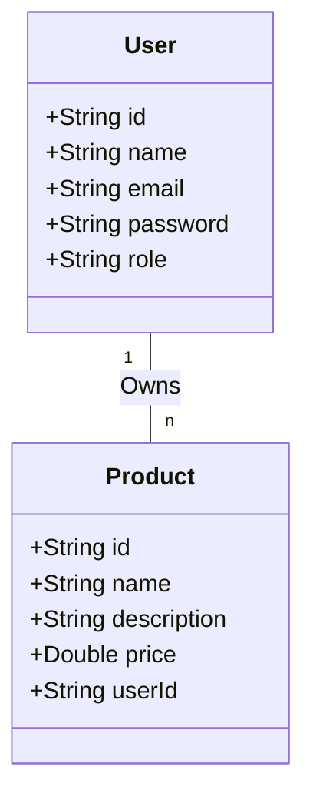

# Let's Play - Java Advanced API

## Overview
**Let's Play** is a secure and scalable RESTful CRUD API built with **Spring Boot** and **MongoDB**. This project manages two main entities: **Users** and **Products**, allowing full lifecycle management (Create, Read, Update, Delete) with a robust security layer.

This system is designed for a small e-commerce platform where administrators can manage all users and products, while authenticated users can manage their own product listings.

## Learning Objectives
- Master **Spring Boot** and **RESTful API** design.
- Integrate and manage data using **MongoDB**.
- Implement full **CRUD operations** for multiple entities.
- Apply **Spring Security** with **JWT (JSON Web Token)** authentication.
- Implement **Role-Based Access Control (RBAC)** (ADMIN vs. USER).
- Secure password management using **BCrypt** hashing and salting.
- Develop robust **Global Error Handling** with meaningful HTTP responses.

## 1. Database Design
The system uses a one-to-many relationship where one user can own multiple products.

## 2. API Endpoints
All API responses are returned in **JSON** format.

### Products
| Method | Endpoint | Access | Description |
|---|---|---|---|
| GET | `/api/products` | Public | List all available products |
| POST | `/api/products` | Authenticated | Create a new product |
| PUT | `/api/products/{id}` | Owner/Admin | Update product details |
| DELETE | `/api/products/{id}` | Owner/Admin | Delete a product |

### Users (Admin Only)
| Method | Endpoint | Access | Description |
|---|---|---|---|
| GET | `/api/users` | Admin | List all registered users |
| GET | `/api/users/{id}` | Admin | Get user details by ID |
| PUT | `/api/users/{id}` | Admin | Update user information |
| DELETE | `/api/users/{id}` | Admin | Remove a user |

### Authentication
| Method | Endpoint | Description |
|---|---|---|
| POST | `/api/auth/register` | Register a new account |
| POST | `/api/auth/login` | Login and receive a JWT token |

## 3. Authentication & Authorization
- **JWT Implementation**: Stateless authentication using Spring Security.
- **Roles**:
  - **ADMIN**: Can manage all users and all products.
  - **USER**: Can manage only their own products.
- **Secure Transmission**: Designed to work over HTTPS.

## 4. Security Measures
- **Password Hashing**: BCrypt is used for hashing and salting passwords before storage.
- **Input Validation**: Sanitization of user inputs to prevent MongoDB injection attacks.
- **Data Privacy**: Sensitive fields (like passwords) are excluded from API responses.
- **Access Control**: Strict enforcement of role-based permissions on all endpoints.

## 5. Error Handling
The API implements a global exception handler to ensure consistency:
- **No 5XX leakage**: All unhandled exceptions are caught and returned as clean JSON responses.
- **HTTP Status Codes**:
  - `400 Bad Request`: Validation errors.
  - `401 Unauthorized`: Missing or invalid credentials.
  - `403 Forbidden`: Insufficient permissions.
  - `404 Not Found`: Resource does not exist.
  - `409 Conflict`: Resource already exists (e.g., email duplication).

## 6. Constraints & Standards
- Built with **Spring Boot** and **MongoDB**.
- Pure **JSON** communication.
- No sensitive data exposed in responses.
- Clean, modular, and well-structured code.

## 7. Resources
- [Spring Initializr](https://start.spring.io/)
- [Spring Boot Documentation](https://docs.spring.io/spring-boot/docs/current/reference/html/)
- [Spring Security Guide](https://spring.io/guides/topicals/spring-security-architecture/)
- [JWT Introduction](https://jwt.io/introduction/)
- [MongoDB Documentation](https://www.mongodb.com/docs/)

---
*Created as part of the Java Advanced curriculum.*
