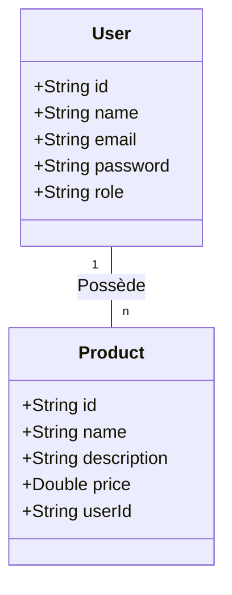

# Let's Play - API Java Avancée

## Vue d'ensemble
**Let's Play** est une API RESTful CRUD sécurisée et scalable construite avec **Spring Boot** et **MongoDB**. Ce projet gère deux entités principales : les **Utilisateurs** (Users) et les **Produits** (Products), permettant une gestion complète de leur cycle de vie (Création, Lecture, Mise à jour, Suppression) avec une couche de sécurité robuste.

Ce système est conçu pour une petite plateforme de type e-commerce où les administrateurs peuvent gérer tous les utilisateurs et produits, tandis que les utilisateurs classiques ne peuvent gérer que leurs propres annonces de produits.

## Objectifs d'apprentissage
- Maîtriser **Spring Boot** et la conception d'**API RESTful**.
- Intégrer et gérer des données avec **MongoDB**.
- Implémenter des **opérations CRUD** complètes pour de multiples entités.
- Appliquer **Spring Security** avec une authentification par token **JWT (JSON Web Token)**.
- Mettre en place un **Contrôle d'Accès Basé sur les Rôles (RBAC)** (ADMIN vs USER).
- Gérer les mots de passe de manière sécurisée via le hachage et salage **BCrypt**.
- Développer une **gestion globale des erreurs** robuste avec des réponses HTTP explicites.

## 1. Modélisation de la base de données
Le système utilise une relation "un-à-plusieurs" (One-to-Many) où un utilisateur peut posséder plusieurs produits.

## 2. Points de terminaison (Endpoints) de l'API
Toutes les réponses de l'API sont renvoyées au format **JSON**.

### Produits (Products)
| Méthode | Endpoint | Accès | Description |
|---|---|---|---|
| GET | `/api/products` | Public | Liste tous les produits disponibles |
| POST | `/api/products` | Authentifié | Crée un nouveau produit |
| PUT | `/api/products/{id}` | Propriétaire/Admin | Met à jour les détails d'un produit |
| DELETE | `/api/products/{id}` | Propriétaire/Admin | Supprime un produit |

### Utilisateurs (Admin Uniquement)
| Méthode | Endpoint | Accès | Description |
|---|---|---|---|
| GET | `/api/users` | Admin | Liste tous les utilisateurs enregistrés |
| GET | `/api/users/{id}` | Admin | Récupère les détails d'un utilisateur par son ID |
| PUT | `/api/users/{id}` | Admin | Met à jour les informations d'un utilisateur |
| DELETE | `/api/users/{id}` | Admin | Supprime un utilisateur |

### Authentification
| Méthode | Endpoint | Description |
|---|---|---|
| POST | `/api/auth/register` | Inscrit un nouveau compte |
| POST | `/api/auth/login` | Connecte un utilisateur et renvoie un token JWT |

## 3. Authentification & Autorisation
- **Implémentation JWT** : Authentification stateless (sans état) en utilisant Spring Security.
- **Rôles** :
  - **ADMIN** : Peut gérer tous les utilisateurs et tous les produits.
  - **USER** : Peut gérer uniquement ses propres produits.
- **Transmission Sécurisée** : Conçu pour fonctionner sur HTTPS.

## 4. Mesures de Sécurité
- **Hachage de mots de passe** : BCrypt est utilisé pour hacher et saler les mots de passe avant le stockage en base.
- **Validation des entrées** : Nettoyage (Sanitization) des entrées utilisateurs pour prévenir les attaques par injection MongoDB.
- **Confidentialité des données** : Les champs sensibles (comme les mots de passe) sont exclus des réponses de l'API.
- **Contrôle d'accès** : Application stricte des permissions basées sur les rôles sur l'ensemble des endpoints.

## 5. Gestion des Erreurs
L'API implémente un gestionnaire global d'exceptions (Global Exception Handler) pour assurer une cohérence :
- **Pas de fuite d'erreur 5XX** : Toutes les exceptions non gérées sont interceptées et renvoyées sous forme de réponses JSON propres.
- **Codes de Statut HTTP** :
  - `400 Bad Request` : Erreurs de validation.
  - `401 Unauthorized` : Identifiants manquants ou invalides.
  - `403 Forbidden` : Permissions insuffisantes (accès refusé).
  - `404 Not Found` : La ressource n'existe pas.
  - `409 Conflict` : La ressource existe déjà (ex. email dupliqué).

## 6. Contraintes & Standards
- Construit avec **Spring Boot** et **MongoDB**.
- Communication exclusivement en **JSON**.
- Aucune donnée sensible n'est exposée dans les réponses.
- Code propre, modulaire et bien structuré.

## 7. Ressources
- [Spring Initializr](https://start.spring.io/)
- [Documentation Spring Boot](https://docs.spring.io/spring-boot/docs/current/reference/html/)
- [Guide Spring Security](https://spring.io/guides/topicals/spring-security-architecture/)
- [Introduction à JWT](https://jwt.io/introduction/)
- [Documentation MongoDB](https://www.mongodb.com/docs/)

---
*Créé dans le cadre du cursus Java Avancé.*
